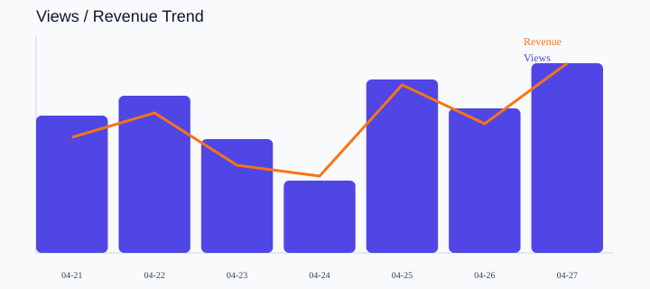

# 运营周报

- Report type: weekly
- Date range: 2026-04-21 ~ 2026-04-27
- Source record count: 7

## Core Metrics

| Metric | Value |
| --- | ---: |
| Views | 8490 |
| Clicks | 954 |
| Leads | 186 |
| Conversions | 42 |
| Revenue | 33000.00 |
| CTR | 11.24% |
| Lead Rate | 19.50% |
| Conversion Rate | 22.58% |

## Channel Performance

1. douyin: views 5650, leads 125, revenue 22300.00
2. xiaohongshu: views 2220, leads 45, revenue 7900.00
3. wechat: views 620, leads 16, revenue 2800.00

## Visualization

